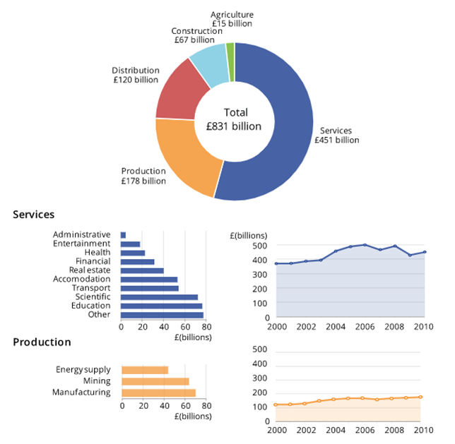

## NHS Colour Palette  
  
This guidance uses the NHS Colour palette as a basis for data visualisation colour needs within the NHS Business Services Authority (NHSBSA). Using best practice, it has been created to help standardise our products for internal and external users, ensuring consistency, brand reputation and familiarity with our dashboards.  
This helps towards creating a cohesive user experience, and for data visualisation, helps the user to quickly and easily use our products, extracting meaningful and informed insight.  
[Link to the internal NHSBSA branding site][colours 1]  
  

## Accessibility of Colours  
  
To ensure our charts are usable to all users, colours must be used with enough contrast, sparsely and purposefully.   
[Source][colours 2]  
Contrast ratios should be checked to help with conditions such as low vision and colour blindness. Keeping a 3 to 1 contrast ratio between adjacent colours (as set out in success criterion 1.4.11) is important for people with low vision.  
[Source][colours 3]  
  
## Aspects to be considered  
  
- Limit the number of colours you use to be those necessary, and which helps the user’s clarity.
-	Use colour consistently; colours should be aligned consistency to the same variables (Example A).
-	Consider colour associations and personalisations; consider whether colours should be used to denote certain meanings. For example, if the NHS is being used as a comparison against another organisation, it might be appropriate to use NHS Blue.
-	Colour contrast; ensure there is enough of a contrast between the colours used. The Web Content Accessibility Guidelines (WCAG) which the UK accessibility legislation aligns to, require a 3 to 1 ratio for graphical elements and 4.5 to 1 ratio for text. The WebAIM colour contrast checker may help: [WebAIM Contrast Checker 1][webaim 1] or [WebAIM Contrast Checker 2][webaim 2] 
-	Colour should not be used as the only way to communicate information. This is stated in accessibility success criterion 1.4.1. Ensure there is an alternative option for users to obtain the same information.  
[Source][colours 4] 
  
Example A: Using colour to connect information. Note how ‘Services’ uses a dark blue in each chart, and Production is denoted by orange.  
  
  
[Source][colours 5]  

  
    

[colours 1]: https://nhsbsauk.sharepoint.com/sites/CommsMarketing/SitePages/Our-brand.aspx
[colours 2]: https://analysisfunction.civilservice.gov.uk/policy-store/data-visualisation-colours-in-charts/#relevant-success-criterion-for-colours-in-charts
[colours 3]: https://analysisfunction.civilservice.gov.uk/policy-store/data-visualisation-colours-in-charts/#section-3
[webaim 1]: https://webaim.org/resources/contrastchecker/
[webaim 2]: https://contrastchecker.com/
[colours 4]: https://analysisfunction.civilservice.gov.uk/policy-store/data-visualisation-colours-in-charts/#section-3
[colours 5]: https://style.ons.gov.uk/data-visualisation/using-colours/using-colour-to-connect-information/
