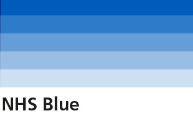
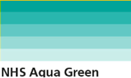
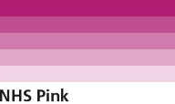
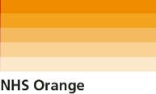
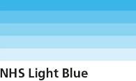
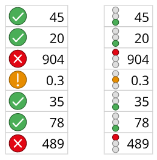

## Categorical Data  
  
Categorical data can be divided into groups or categories by using names or labels.  
Using four categories is best practice for data visualisation. More than four series can make a chart too cluttered. Consider merging multiple categories or focusing the chart on a single entity if suitable.  
[Source][cat 1]  
  
For categorical data, the following colours taken from the NHS identity guideleines can be used:  

|||---|||
#### Colour	
NHS Blue	
NHS Aqua Green
NHS Pink
NHS Orange
NHS Green
NHS Light Blue
NHS Blue
NHS Aqua Green	
NHS Pink
NHS Orange
NHS Green	
NHS Light Blue  

#### Tint
100%
100%
100%
100%
100%
100%
50% tint
50% tint
50% tint
50% tint
50% tint
50% tint  

#### Hex Code
#005EB8
#00A499
#AE2573
#ED8B00
#009639
#41B6E6
#80afdc
#80d2cc
#d792b9
#f6c580
#80cb9c
#a0dbf3
|||---|||  
  
    
      
      

Bear in mind that certain colours have certain meanings, and that use of colour is important.  
Whilst over 4 categories and colours is not recommended, you will notice that after the first 6 colours, the colours are repeated at a 50% tint, still distinguishable to the user, and not adding in additional colours.  
[Source][cat 2]  
  

We recommend using our suggested colour palette in the order given in the list to make sure adjacent colours have enough contrast. It will also mean the colours will work for different types of colour blindness and in greyscale.  
[Source][cat 3] 

### Simple charts  

Use a single colour for a single line chart, and all bars in vertical column charts and horizontal bar charts where there are no groups to highlight. NHS Blue (#005EB8) is the primary colour to be used across our products, and therefore the first colour in the palette.  
[Source][cat 4]  
  
### Line charts  
  
As with stacked and clustered bar charts, we advise that line charts should have no more than four series.  
It is difficult to choose colours for line charts with more than two series. This is because it is not possible to have a chart colour palette of more than two colours where all colours have at least a 3 to 1 contrast ratio with:
-	the background
-	all other colours in the palette  
Lines do not always stay in the same order. So, it is not possible to make sure adjacent colours always have at least a 3 to 1 contrast ratio.  
This means that it is not possible to provide a palette for line charts with more than two series that would meet the contrast ratio requirements. So, you should only use line charts with more than two series when they are essential to getting information across. This will help you meet accessibility success criterion 1.4.11.  
  
Guidance, such as labelling lines, using textures or shapes for data points may work to distinguish multiple categories. You can see more advice within the source link.  
[Source][cat 5]  
  
    
### Pie charts  
  
Pie charts should use different shades of one colour where possible, rather than different colours. This is so a colour-blind user can easily distinguish between the segments with the colours being close together.  
[Source][cat 6]   
[Source][cat 7]   

### RAG (Red/Amber/Green) status  
  
Colour should not be the only method fo conveying information.  
If you are using red to signal 'warning' or 'caution', and green to signal 'approval' or 'correctness' consider addign a symbol to make sure colour-blind users can still understand the message.  
  
Use additional encoding methods such as symbols or positions to convey meaning:  

  
  
[Source][cat 8]

ONS accessibility tested colours are:
-	Green: #0f8243
-	Neon yellow: #f0f762
-	Sun yellow: #fbc900
-	Jaffa orange: #fa6401
-	Red: #d0021b  
  
[Source][cat 9] 

[cat 1]: https://analysisfunction.civilservice.gov.uk/policy-store/data-visualisation-colours-in-charts/#section-5
[cat 2]: https://www.england.nhs.uk/nhsidentity/identity-guidelines/colours/
[cat 3]: https://analysisfunction.civilservice.gov.uk/policy-store/data-visualisation-colours-in-charts/#section-5
[cat 4]: https://analysisfunction.civilservice.gov.uk/policy-store/data-visualisation-colours-in-charts/#section-5
[cat 5]: https://analysisfunction.civilservice.gov.uk/policy-store/data-visualisation-colours-in-charts/#section-5
[cat 6]: https://style.ons.gov.uk/data-visualisation/using-colours/using-colour-in-pie-charts/
[cat 7]: https://www.colourblindawareness.org/colour-blindness/
[cat 8]: https://style.ons.gov.uk/category/data-visualisation/using-colours/#using-red-and-green
[cat 9]: https://service-manual.ons.gov.uk/design-system/foundations/colours
