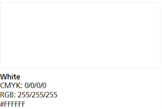
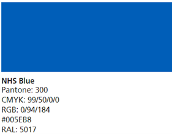
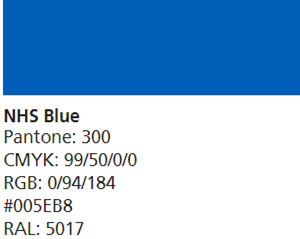
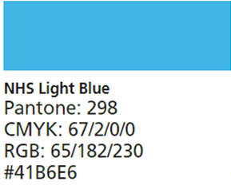
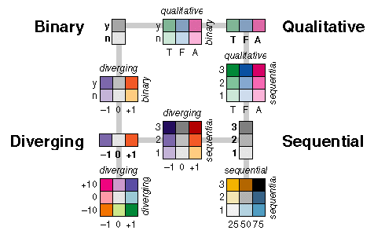

## Primary colours  

[Source][pc 1]  

### Background  
  
Use a plain background, NHS Grey 5 (#f0f4f5) should be used.  
NHS White (#ffffff) is used to make important information stand out and for alternating backgrounds, for example on the NHS website home page.  

   
[Source][pc 2]  
  

### Single variables  
NHS Blue (#005EB8) is the primary colour to be used across our products.  

  

### Two variables  
NHS Blue (#005EB8) alongside NHS Light Blue (#41B6E6) is recommended for two variables.  
      
  

### Related variables  
NHS Blue (#005EB8) alongside NHS Light Blue (#41B6E6) is recommended for two variables. For related variables such as comparing adults and children across two groupings, a 50% tint if recommended. Meaning for each grouping, the colour will be consistent, with two tints.  

If you need to use tints of this palette and have a small number of tints needed, use either 25% or 50%. We recommend 50%. If tints do not pass contrast ratio checks and the visualisation is suitable (i.e. not a line graph), a border should be created to further enhance the colour.  

Otherwise, tints of 80%, 60%, 40% and 20% can be used. Any % value is accepted as long as it is visible, clear and accessible.  

Note: we only recommend outlining the bars when using tints of a palette, in general, bar outlines add unnecessary clutter. We outline all bars to maintain consistency.  

[Source][pc 3]  
[Source][pc 4]  
[Sourc][pc 5]  

For an indication of colour schemes and combinations using binary, qualitative, diverging and sequential data the diagram below is useful:  
  
  
[Source][pc 6]  
  
  

[pc 1]: https://service-manual.nhs.uk/design-system/styles/colour
[pc 2]: https://service-manual.nhs.uk/design-system/styles/colour
[pc 3]: https://design-system.service.gov.uk/styles/colour/
[pc 4]: https://analysisfunction.civilservice.gov.uk/policy-store/data-visualisation-colours-in-charts/#section-6
[pc 5]: https://www.england.nhs.uk/nhsidentity/identity-guidelines/colours/#:~:text=use%20of%20highlights.-,Using%20tints,-Tints%20are%20percentage
[pc 6]: https://web.natur.cuni.cz/~langhamr/lectures/vtfg1/mapinfo_2/barvy/colors.html