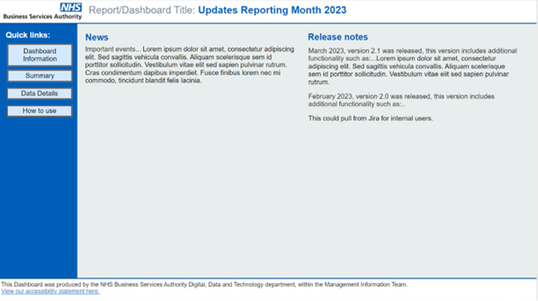
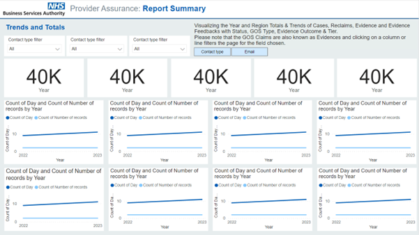
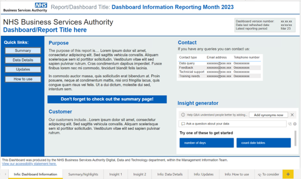
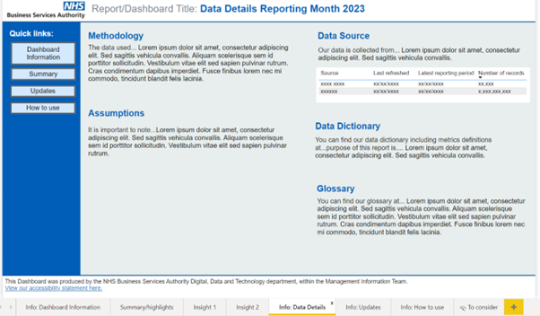
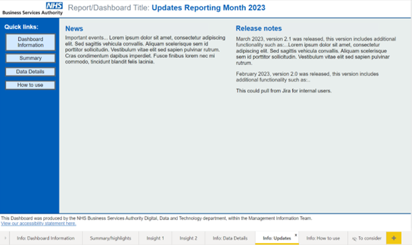

## Information pages  
  
The information pages are a rough wireframe to be used as a guide to the features that could be included. The idea is that a dashboard developer has a rough template to use any features they see fit. The template can be used across the organisation.  
The layout of the pages and colour scheme/format have been checked against best practice, although as a wireframe draft the template has not yet been accessibility tested.  
Benefits of information pages include:  
-	Encouraging data literacy, and a user’s understanding of what is being shown.
-	Encouraging interactivity with dashboards.
-	Encouraging confidence and self-sufficiency within users to use our dashboards and analyses to the full extent.
-	Informing users of important relevant information.
-	A standardised and reliable approach across dashboards, enabling a user’s ease-of-use.  
  
The information pages are designed to compliment the reporting pages, with an initial Dashboard information page, followed by the reporting pages, and with any other complimentary dashboard information pages at the end of the report for consultation by the user if needed. The pages created in the wireframe are:  
-	Info: Dashboard information – page 1
-	Summary/highlights – page 2
-	Insight 1 – page 3
-	Insight 2 – page 4
-	Info: Data Details – page 5
-	Info: Updates – page 6
-	Info: How to use – page 7  
  
The wireframe was created in Power BI, although the features can be recreated in alternative data visualisation tools.  
The content of the dashboard should be automated wherever possible to minimise manual intervention.  
Please note, this dashboard does not consider a personalised or role-based user journey based on user access, however this is something we can look into.  

  
### General layout  
  
The information pages have the following features present across each page:  
-	The NHS Business Services Authority logo in the top left corner, acting as a hyperlink to the front page.
-	The Report/Dashboard Title and name of the page, alongside the reporting month and year.
-	A quick links section on the left-hand side of the page is optional. This panel is designed not to duplicate a list of all pages, but to highlight key pages the user may be interested in.
-	Information in the main body of the page.
-	A footer to state who created the dashboard, and a link to the accessibility statement.
-	The background is NHS Grey 5 (#f0f4f5). Please see the colour guidance for more details.  
  
  
### Text content  
  
Your content should follow the corporate NHS Business Services Authority Content Design Standards - [Link][info 1]  
  
Some important notes in relation to your text content:  
-	A Header 1 has been used on each page to help navigate a screen reader, Header 1 should be size 16px.
-	The body of the text should be size 12px. [Source][info 2]
-	Frutiger or Arial should be used as the font throughout the report. The core NHS font is Frutiger and the secondary font is Arial. [Source][info 3]  

This is a basic example of one of the pages:  
  
  
An example of how the dashboard guidelines might look in a report:  
  
  
Please note, if there was an urgent update for users to be aware of, a banner spanning the top of the dashboard such as the below should be used.  
  
  
  
### Dashboard information - page 1  
  
The Dashboard Information page has been designed as an introduction to the dashboard, to allow the users to check the reporting period and refreshed date of the data. It clearly states the purpose of the dashboard to the user to give context.  
It also benefits the perceived performance of the dashboard being the initial page a user is directed to as charts and data can load on other pages whilst the user checks the details shown.  
  
It includes:  
-	In addition to the usual information page layout the Dashboard Information page has a title bar, more clearly stating the organisation name, and dashboard report title.
-	Dashboard version number is included in the top right, this enables the user and developer to ensure they are working from the same dashboard version should an issue arise.
-	Data last refreshed date is included in the top right to ensure the user can quickly check when the data was last refreshed.
-	Latest reporting period is included in the top right as another key piece of information, this ensures that the user knows when the data will display up until, even if the data was refreshed more recently.
-	The purpose of the report should give context to how the report came about, and what it hopes to achieve.
-	A nudge theory box directing the user, to encourage the user to next access the summary page or help direct the user’s journey within the dashboard.
-	The customer area should clearly state who the main users are and their interest in the data.
-	A contact section for users in case of queries, feedback, training needs or technical support.
-	An insight generator for users to ask questions and generate insights from the data.  
  
  
  
    
### Data details - page 5  
  
The Data Details page has been designed to inform the user further on the details of the data, enabling data literacy and aiding understanding and therefore use of the report.  
  
It includes:  
- 	Methodology, for example, around the collection of data, or data included in the report.
-	Any assumptions made to the datasets.
-	Data source details, including various data sources, the date the data was last refreshed, the latest reporting period and number of records (which is useful to see if there are any issues, for example, if less records are showing than expected).
-	Data Dictionary details, and a link so that users can see definitions of the data and formats. This helps users to see the data lineage and understand the metadata behind the reports.
-	Glossary details around the terminology used, and a link so that users can access and understand relevant terminology included in the report.  
  
  
  
  
### Updates - page 6  
  
The Updates page is designed to help inform users on relevant news, release updates, and any other ongoing updates beneficial to the user.
It includes:  
-	Relevant news to help inform users on key events which could have had an impact on the data shown.
-	Links to relevant NHSBSA sites and news.
-	Release notes relating to the dashboard version numbers so that users are informed of new features, improvements, or bug fixes. 
-	Announcements could be included in this section, for example if the NHSBSA has been made aware of an issue, and a fix is working to be put in place.  
  
  
  
    
### How to use - page 7  
  
The How to use page is relevant especially for users who have limited technological literacy and may not be as familiar with the reporting software used. It aims to help guide users, limit support needed, maximise usage and optimise intake of the dashboard and information shown.  
  
It includes:  
-	Dashboard functionality to give details on functions within the dashboard, for example, users may not be familiar with drill down functionality and how to access it, therefore might miss this feature and other insights if not prompted to look and use this function.
-	Links to relevant articles or training courses could be useful, for example, NHSBSA training courses sign up or Microsoft could be referenced for Power BI reports.
-	Accessibility hints could be included in this section, for example, how to change from a chart format to a table.  
  

[info 1]: https://nhsbsauk.sharepoint.com/sites/digital-and-online-team/SitePages/Content-Design-Style-Guide.aspx
[info 2]: https://www.gov.uk/government/publications/inclusive-communication/accessible-communication-formats#accessible-print-publications
[info 3]:  https://www.england.nhs.uk/nhsidentity/identity-guidelines/fonts/