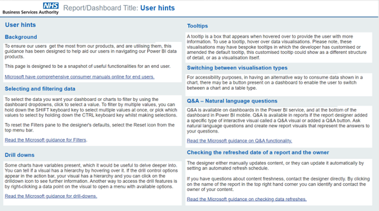
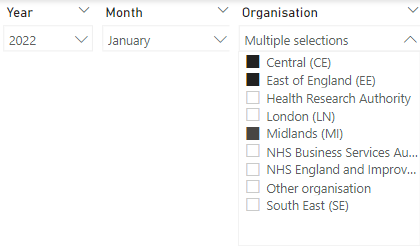
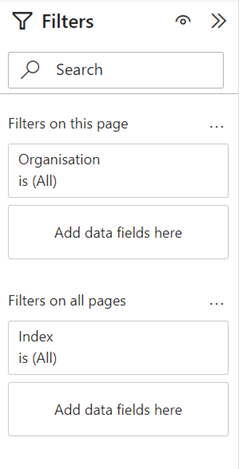
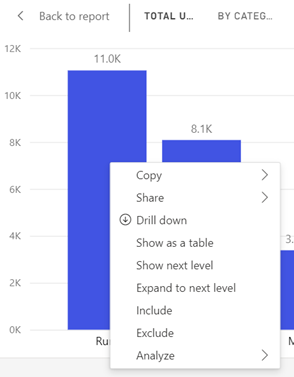
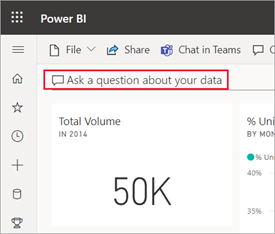

The Power BI section includes functionalities and ways of working specific to Power BI but it is worth mentioning that the Power BI guidance must go hand in hand with the Data Visualisation Standards when producing Data Visualisation Products.  
    

## Background  
  
There are many functionalities available in a Power BI dashboard, and our users have varying levels of data literacy and data visualisation skills to navigate our data products. To ensure our users get the most from our products, and are utilising them, this guidance has been designed to help aid our users in navigating our Power BI data products.  
  
This document is designed to be a snapshot of useful functionalities for an end user. Microsoft have [comprehensive consumer manuals][hint 1] online for end users.  
  
To ensure our users have access to this information as they need it, it is recommended to add a ‘User Hints’ page to the dashboard, which is hidden unless the user clicks on the button and relevant description to navigate to this page. This links in with the ‘Layout of a dashboard’ and ‘About Pages’ documentation guidance.  
  
An example of what this could look like for a user has been created within the Power BI template:  
  
  
  
## Selecting and filtering data  
  
Filtering your dashboard by selections is extremely useful. A dashboard can be developed to have dropdowns present, or a filter panel present. To select the data you want your dashboard or charts to filter by using the dashboard dropdowns, click to select a value. To filter by multiple values, you can hold down the SHIFT keyboard key to select multiple values at once, or pick which values to select by holding down the CTRL keyboard key whilst making selections.  
  
An example of a dashboard dropdown filters, with selections made using the CTRL key:  
  

You can also select and filter your dashboard by values in a table or chart by using the SHIFT or CTRL keyboard keys.  
  
If a filter panel is present, there is no need to use keyboard keys to use the filter. It will work by clicking on selections. Filters can either work across all pages, or across one page in particular. The developer chooses which filters are present on a dashboard.  
  

To reset the Filters pane to the designer's defaults, select the Reset icon from the top menu bar.  
  

Microsoft have [guidance for filters][hint 2] available online.  

## Drill downs  
  
Some charts have variables present, which it would be useful to delve deeper into. For example, if you have a chart showing the number of individuals within a directorate, it might be useful to click on the directorate, and drill-down to see a further breakdown on the number of individuals within a service area. Only hierarchical values (such as Directorate -> Service Area) can be drilled into. The developer of the dashboard builds in this functionality.  
  
You can tell if a visual has a hierarchy by hovering over it. If the drill control options appear in the action bar, your visual has a hierarchy and you can click on the drilldown icon to see further information:  
  
  
Another way to access the drill features is by right-clicking a data point on the visual to open a menu with available options.  
  
  
Microsoft have [guidance for drill downs][hint 3] available online. 
  
    
## Tooltips  
  
A tooltip is a box that appears when hovered over to provide the user with more information. To use a tooltip, hover over data visualisations. Please note, these visualisations may have bespoke tooltips in which the developer has customised or amended the default tooltip, this customised tooltip could show as a different structure of detail, or as a visualisation itself.  
See the playbook [tooltips page](../../../data-visualisation/tooltips/tooltips.md) for more detail.
  
  
## Switching between visualisation types  
  
For accessibility purposes, in having an alternative way to consume data shown in a chart, there may be a button present on a dashboard to enable the user to switch between a chart and a table type.  
  
    
## Q&A - Natural language questions  
  
Q&A is available on dashboards in the Power BI service, and at the bottom of the dashboard in Power BI mobile.  
Q&A is available in reports if the report designer added a specific type of interactive visual called a Q&A visual or added a Q&A button. Ask natural language questions and create new report visuals that represent the answers to your questions.  

  
  

Microsoft have [guidance on Q&A functionality][hint 4] available online. 
  
    
## Checking the refreshed date of a report and the owner  
  
What can you do to ensure you're using the latest content? In most cases, you don’t need to do anything at all. Any content, like apps, dashboards, scorecards, or reports, that's been shared with you is automatically refreshed and updated on a schedule that's set by the designer. The designer either manually updates content, or they can update it automatically by setting an automated refresh schedule.  
  
If you have questions about content freshness, contact the designer directly. The examples below show you how to identify and contact the owner of your content.  
  
  
Microsoft have [guidance on checking data refreshes][hint 5] available online.  
  
    
## Bookmarking settings on a report  
  
Please note, this functionality requires a Pro or Premium licence.  
  
A bookmark captures the state of a report page. It includes the settings you've made to filters, slicers, and visuals on that page. After the report page is set the way you want, give it a friendly name. Now you can easily return to that state of the report page. Select a bookmark, and Power BI takes you back to that view.  
  
The maximum number of personal bookmarks per report is 20. When you create a bookmark, the following elements are saved with the bookmark:  
- The current page
- Filters
- Slicers, including slicer type (for example, dropdown or list) and slicer state
- Visual selection state (such as cross-highlight filters)
- Sort order
- Drill location  
  
Microsoft have [guidance on bookmarks][hint 6] available online.

  

[hint 1]: https://learn.microsoft.com/en-us/power-bi/consumer/
[hint 2]: https://learn.microsoft.com/en-us/power-bi/consumer/end-user-report-filter
[hint 3]: https://learn.microsoft.com/en-us/power-bi/consumer/end-user-drill
[hint 4]: https://learn.microsoft.com/en-us/power-bi/consumer/end-user-q-and-a
[hint 5]: https://learn.microsoft.com/en-us/power-bi/consumer/end-user-fresh
[hint 6]: https://learn.microsoft.com/en-us/power-bi/consumer/end-user-bookmarks 